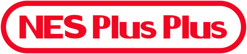
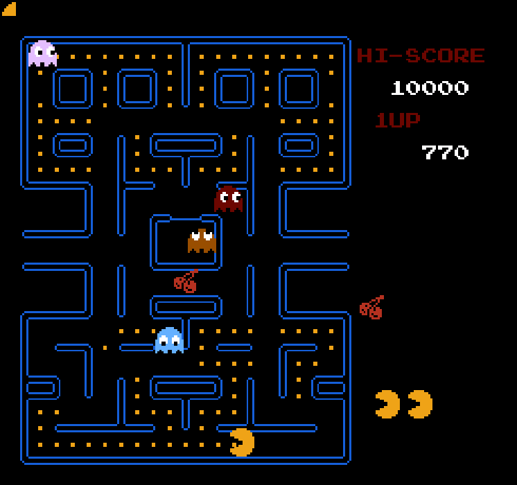
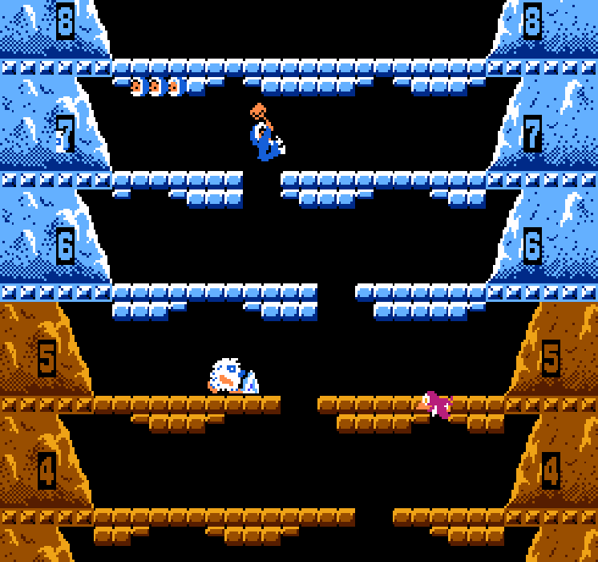
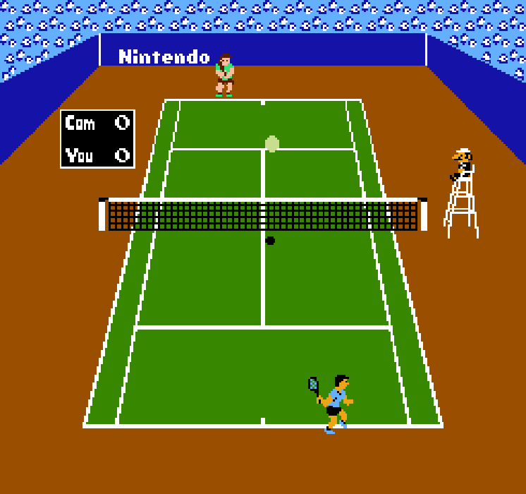

<div id="user-content-toc" align="center">
  <ul style="list-style: none;">
    <summary>
      
    </summary>
  </ul>
  <h3>SDL3-based Nintendo Entertainment System emulator</h3>
</div>

> [!WARNING]
> NES Plus Plus currently only supports games that use **NROM** cartridges

## Purpose
This project is a personal exploration into computer design and architecture.

## Installation & Running
1. Download the latest release [here](https://github.com/ByteLabDev/NES-Plus-Plus/releases/latest).
2. Extract the folder, run NES-Plus-Plus.exe
3. Navigate to the menu bar: **File > Load ROM**
    - Select any `.nes` file to start.

> [!WARNING]
> Make sure you select the current region before loading the ROM in **Edit > Options**

## Screenshots & Demos
<p align="center">
   
  
  
  
</p>

## Controls
<div align="center">

| Keyboard | Xbox | NES |
| :--- | :--- | :--- |
| Up | D-Pad Up | ↑ |
| Down | D-Pad Down | ↓ |
| Left | D-Pad Left | ← |
| Right | D-Pad Right | → |
| S | Start (Menu) | Start |
| A | Back (View) | Select |
| Z | X | B |
| X | A | A |

</div>

## Building
### Clone the repo
```
git clone https://github.com/ByteLabDev/NES-Plus-Plus.git
cd NES-Plus-Plus
```

### Configure and Build
```
cmake -B build
cmake --build build --config Release
```

## Tech Stack
- Language: C++
- Libraries: SDL3, Dear ImGui

# License
